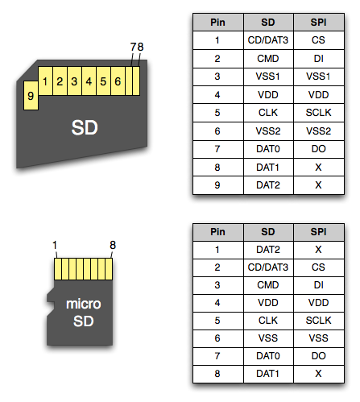

# ESP32 从 SD 卡读取图片并显示

我上周研究了一波 SD 卡的原理与支持的协议，这周就来实践一下。

## SD 卡的读写原理

原理部分参见之前的笔记 [存储器的种类、接口与协议](../interface-protocol/存储器的种类、接口与协议.md)

这里简单总结下，我手上的 SD 卡有两种形态：

- microSD 卡，有 8 个引脚，非常常见，我手上有 8G 16G 64G 128G 四种规格的 microSD 卡。
  - 8 个引脚能跑 SPI 协议，也能跑 MMC 协议。
- SD 卡套，它能将 microSD 卡转换成 SD 卡，它具有 9 个引脚，除了 SPI/MMC 外，还支持 UHS-I，最高速率要
  比直接用 microSD 快一倍。

上述两种卡的引脚定义如下：

| SPI 引脚 | 解释            |
| -------- | --------------- |
| CS       | Card Select     |
| DI       | Data In [MOSI]  |
| VSS      | Ground          |
| VDD      | Power           |
| CLK      | Clock [SCLK]    |
| DO       | Data Out [MISO] |

## 用到的硬件

ESP32S3 + ILI9488 3.5 寸显示屏 + 64G microSD 卡。

esp-idf 官方有提供两个示例：

- [esp-idf/examples/storage/sd_card](https://github.com/espressif/esp-idf/tree/master/examples/storage/sd_card)

其中 SPI 模式最通用，所有 ESP 芯片都支持此模式。它仅用到了 6 个引脚，其中 4 个数据引脚的接线关系如
下：

| SD card pin | SPI pin | ESP32 pin     | ESP32-S2, ESP32-S3 | ESP32-H2 | ESP32-C3 and other chips | Notes      |
| ----------- | ------- | ------------- | ------------------ | -------- | ------------------------ | ---------- |
| D0          | MISO    | GPIO2         | GPIO37             | GPIO0    | GPIO6                    |
| D3          | CS      | GPIO13 (MTCK) | GPIO34             | GPIO1    | GPIO1                    |
| CLK         | SCK     | GPIO14 (MTMS) | GPIO36             | GPIO4    | GPIO5                    |
| CMD         | MOSI    | GPIO15 (MTDO) | GPIO35             | GPIO5    | GPIO4                    | 10k pullup |

MMC 4-lines 模式速度更高，但是目前仅 ESP32 与 ESP32S3 支持。它用到了全部 8 个引脚，其 6 个数据引脚接
线关系参见前面的官方 example README.

## 接线

我的 3.5 寸 SPI 显示屏自带了 SD 卡插槽，所以我只需要将 ESP32S3 的 SPI 引脚与该显示屏的 SPI 引脚接好
即可，只要屏幕能正常显示，那 SD 卡也将能正常读写。

另外需要注意，官方明确表示，建议使用板上 SD 卡槽，而不是外接线缆，因为外接线缆可能会影响 SPI/MMC 通
信的稳定性，所以在使用外接线缆必须降低 SPI/MMC 通信的速率。

## 代码
