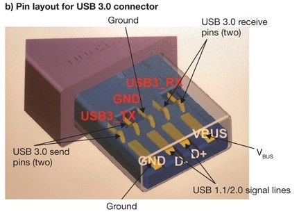
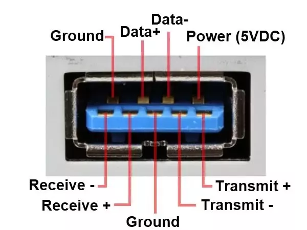

# IP-KVM 之 ESP32 HID 远程键盘鼠标

ip-kvm 目前已经有许多成熟的方案了，比如 [pikvm](https://github.com/pikvm/pikvm) 跟 [Nihiue/open-ip-kvm](https://github.com/Nihiue/open-ip-kvm)，但是它们的成本都比较高，pikvm 用到的树莓派现在价格高得离谱，而 open-ip-kvm 也需要淘早就倒闭的某讯 N1 盒子，价格太高。

但实际上 IP-KVM 需要的就是一个 USB HID 设备模拟键盘鼠标，然后通过 HDMI 视频采集卡采集图像内容，再通过网络实现完全的远程控制。
而 ESP32S3 本身就支持 USB-OTG，

## USB 基础概念

>参考了 [USB 基础知识](https://www.crifan.com/files/doc/docbook/usb_basic/release/html/usb_basic.html#ch02_sw_hw)

USB 是 Universal Serial Bus 的缩写，即通用串行总线，是一种高速的、低成本的、可插拔的、双向的、全双工的、同步的串行总线，它也是最复杂的总线之一。

### 1. USB 硬件描述

硬件上，它是用插头连接。一边是公头（plug），一边是母头（receptacle）。例如，PC 上的插座就是母头，USB 设备使用公头与 PC 连接。

USB 硬件为了满足各种需要，有很多接口类别：

- 普通 PC 上使用的叫 Type-A，是最常见的 USB 接口
  - 通常用内部塑料来区分支持的 USB 版本，USB 2.0 的是白色或黑色，USB 3.0 的是蓝色。
- 老开发板跟非智能机大都使用使用 Micro-USB 或者 Mini-USB，这是两种比较小的 USB 接口，都仅支持到 USB2.0。
  - 其中 Mini-USB 已经完全被淘汰了，Micro-USB 因为成本低，所以主要在一些低端 MCU 开发板、充电器上使用。
- 而现在手机电脑都普遍使用的则是 Type-C，好一点的 MCU 开发板也基本全使用 type-c 取代掉了 micro-usb

USB 1.1/USB2.0 传输速率不高，都只用了 4 根线，定义如下：

| 引脚    | 名称     | 电缆颜色                       | 描述                         |
| ----- | ------ | -------------------------- | -------------------------- |
| 1     | VBUS   | Red                        | +5 V，电源                   |
| 2     | D−     | White                      | Data −，数据线                 |
| 3     | D+     | Green                      | Data +，数据线                 |
| 4     | GND    | Black                      | Ground，接地                  |

而 USB3.0 开始传输速率提升到了 5Gbps，为了支撑这么高的传输速率，改成了 9 根线，定义如下：

| 引脚   | 电缆颜色  | 信号名称('A' connector) | 信号名称('B' connector) |
| ----- | ------ | -------------------------- | -------------------------- |
| 1     | Red    | VBUS                       |
| 2     | White  | D−                         |
| 3     | Green  | D+                         |
| 4     | Black  | GND                        |
| 5     | Blue   | StdA_SSRX−                 | StdA_SSTX−                 |
| 6     | Yellow | StdA_SSRX+                 | StdA_SSTX+                 |
| 7     | Shield | GND_DRAIN                  |
| 8     | Purple | StdA_SSTX−                 | StdA_SSRX−                 |
| 9     | Orange | StdA_SSTX+                 | StdA_SSRX+                 |
| Shell | Shell  | Shield                     |

能看到为了兼容 USB2.0，USB3.0 的 9 根线中，前 4 根线和 USB2.0 一样，另一方面 USB3.0 的接口设计也是兼容 USB2.0 的，仔细看会发现 USB3.0 的 Type-A 接口只是在 USB2.0 的基础上多加了 4 个针脚，所以支持 USB3.0 的设备也可以插到 USB2.0 的接口上，只是速率会降低。如下图所示：

从最新的 USB 4 开始，传输速率提升到了 40Gbps，为了支撑这么高的传输速率，改成了 24 根线，而且仅支持 Type-C 接口，不过这个我暂时接触不到，先略过。

### 2. USB 设备类别

- Host: 主机，必须拥有硬件 Host Controller，负责控制整个总线的数据传输，如电脑。单个 USB 总线上，只能有一个 Host，但是可以接入最多 127 个设备（7bits 地址位）。
- Device(Slave): 设备（从机），可以是 USB 设备，也可以是 USB Hub，如 USB 鼠标键盘、USB 摄像头、USB 音频设备等
- OTG: On The Go，这是在 USB2.0 引入的一种模式，提出了一个新的概念叫主机协商协议（Host Negotiation Protocol），允许两个设备间商量谁去当 Host。这样，一个设备可以同时充当 Host 和 Device，即可以作为 USB 设备连接到电脑上，也可以作为 USB Host 连接鼠标键盘等 USB 设备
  - OTG 功能需要硬件支持，一般手机都支持，但电脑不支持。MCU 中比如乐鑫的 ESP32，也支持 OTG 功能

### 3. USB 控制器类别与传输速率

其中 Host 所用的控制器，又分为好几种类型，表中详细列出了到 USB3.0 为止的几种 USB 主控的说明：

| USB主机控制器类型    | 对应的USB的协议和支持的速率 | 创立者     | 功能划分   | 常用于 |
| --------------- |--------------- |--------------- |--------------- |--------------- |
| OHCI             | USB 1.1=Low Speed和Full Speed         | Compaq，Microsoft和National Semiconductor | 硬件功能 > 软件功能⇒硬件做的事情更多，芯片贵一点但是避免了过多的软件运算，适用于通用计算能力较弱的设备 | 扩展卡，嵌入式开发板的USB主控 |
| UHCI            | USB 1.1=Low Speed和Full Speed | Intel      | 软件功能 > 硬件功能⇒硬件实现的功能少，USB 控制器芯片就便宜，适用于通用计算能力强的设备 | PC 端 |
| EHCI            | USB 2.0=High Speed            | Intel     | 定义了USB 2.0主控中所要实现何种功能，以及如何实现 | 各种USB 2.0主控 |
| xHCI            | USB 3.0=Super Speed           | Intel    | 定义了USB 3.0主控中所要实现何种功能，以及如何实现 | 各种USB 3.0主控 |

传输速率：

- USB1.1 Low Speed: 1.5Mbps
- USB1.1 Full Speed: 12Mbps
- USB 2.0 High Speed: 480Mbps
- USB 3.0 Super Speed: 5Gbps

目前 USB1.1 主要应用在嵌入式领域，可能逐渐在被 USB2.0 取代，当然 USB2.0 也在逐渐被 USB3.0 取代。

### 4. USB Class

USB 协议设计的目的，就是为了用一个 USB 接口取代之前种类繁多的各种其他接口（如鼠标接口、键盘接口、大容量存储、图像接口等等）。
而为了取代其他各种接口，那意味着就要 实现/支持 之前别的接口所对应的各种功能。

因此，USB协议设计的时候，就是要把鼠标、键盘、大容量存储、图像接口等等，这些以前通过其他接口所实现的各种功能，都囊括进来。所以才有了如此多的各种USB的Clas，即分类，根据功能而分出的各种类别。不同的 Class 分类，用于实现对应的功能，适用于相应的设备。

比如我们常见的鼠标和键盘，都属于 Class 3 的 HID，U 盘属于 Class 8 的 Mass Storage 等。

具体的分类表如下：

| Base Class | Descriptor Usage | Description                                        |
| ---------- | ---------------- | -------------------------------------------------- |
| 00h        | Device           | Use class information in the Interface Descriptors |
| 01h        | Interface        | Audio                                              |
| 02h        | Both             | Communications and CDC Control                     |
| 03h        | Interface        | HID (Human Interface Device)                       |
| 05h        | Interface        | Physical                                           |
| 06h        | Interface        | Image                                              |
| 07h        | Interface        | Printer                                            |
| 08h        | Interface        | Mass Storage                                       |
| 09h        | Device           | Hub                                                |
| 0Ah        | Interface        | CDC-Data                                           |
| 0Bh        | Interface        | Smart Card                                         |
| 0Dh        | Interface        | Content Security                                   |
| 0Eh        | Interface        | Video                                              |
| 0Fh        | Interface        | Personal Healthcare                                |
| DCh        | Both             | Diagnostic Device                                  |
| E0h        | Interface        | Wireless Controller                                |
| EFh        | Both             | Miscellaneous                                      |
| FEh        | Interface        | Application Specific                               |
| FFh        | Both             | Vendor Specific                                    |

## 使用 ESP32 系列芯片实现远程鼠标键盘

了解了这么多 USB 的知识，我们就可以开始动手实现一个远程鼠标键盘了。

鼠标键盘本身是一个 USB Device 设备，Class 为 HID，所以我们需要实现一个 HID 设备。

首先 USB 本质上跟 SPI 、I2C、UART 等等一样，都是一种通信协议，那它就能通过两种方式实现：硬件实现和软件实现。

具体而言，要使用 ESP32 实现 HID 设备，有如下几种选项：

- 自带的 USB-OTG 外设：ESP32S3 提供了 USB-OTG 外设，可以直接实现 USB Device
  - ESP-IDF 官方提供了一个硬件实现的 example [esp-idf/examples/peripherals/tusb_hid](https://github.com/espressif/esp-idf/tree/master/examples/peripherals/usb/device/tusb_hid)，但是因为乐鑫仅有 ESP32S2/ESP32S3 这两款芯片自带 USB 控制器，所以这个 example 只能在 ESP32S2/ESP32S3 上运行。
  - 另一个例子 [asterics/esp32_mouse_keyboard](https://github.com/asterics/esp32_mouse_keyboard) 是通过 ESP32 的 BLE 蓝牙协议来实现蓝牙键盘
- 软件实现：如果要使用无 USB-OTG 外设的 ESP32/ESP8266，那就只能使用软件实现的方式了
  - 比如 [cnlohr/espusb](https://github.com/cnlohr/espusb) 就是一个在 ESP8266 上通过软件实现一个 USB Device 的 demo.
- 使用专用 HID 模拟芯片
  - [CH9328-Keyboard](https://github.com/lxydiy/CH9328-Keyboard) 是一个使用 CH9328 芯片实现的 USB HID 键盘设备，该芯片将串口信号转换成 USB 键盘信号发送到 USB Host，这芯片淘宝卖两块钱一颗，贼便宜。

简单起见我使用 ESP32S3 的硬件实现的例子，来实现一个 USB HID 设备。

### 1. 硬件连接

ESP32 的 USB 控制器是 EHCI，所以我们需要使用一个 USB Type-C 接口的 USB Hub，来连接 ESP32 和 PC。

首先 HID 设备不需要多高的速率，所以我们选择 USB 2.0 的 Full Speed 即可，只需要 4 根线，分别是 D+、D-、VBUS、GND。

VBUS 跟 GND 给 4V 供电，D+、D- 连接到 ESP32 的 GPIO19、GPIO20 即可。

### 2. 代码逻辑

