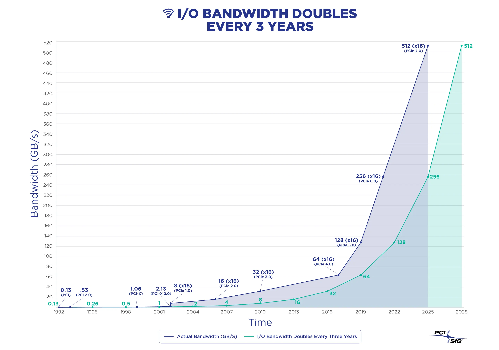

# PCIe - PCI Express

PCIe 作为 PC 的高速数据总线已经 20 多年了，最近迭代越来越快。

| PCIe ® 版本   | 发布时间          | Total Channel Insertion Loss Budget | Root Package | CEM Connector | Add-in Card (AIC) | Remaining System Base Board Budget |
| -------------- | ----------------- | ----------------------------------- | ------------ | ------------- | ----------------- | ---------------------------------- |
| 3.0 (8 GT/s)   | November 10, 2010 | 22 dB                               | 3.5 dB       | 1.7 dB        | 6.5 dB            | 10.3 dB                            |
| 4.0 (16 GT/s)  | October 5, 2017   | 28 dB                               | 5.0 dB       | 1.5 dB        | 8.0 dB            | 13.5 dB                            |
| 5.0 (32 GT/s)  | May 28, 2019      | 36 dB                               | 9.0 dB       | 1.5 dB        | 9.5 dB            | 16.0 dB                            |
| 6.0 (64 GT/s)  | January 11, 2022  | -                                   | -            | -             | -                 | -                                  |
| 7.0 (128 GT/s) | 预计 2025 发布    | -                                   | -            | -             | -                 | -                                  |

PCIe诞生于2003年，在2017年以前发展速度都相对较慢，三、四年更新一次标准。PCIe 3.0发布后甚至等了七年才
推出PCIe 4.0。而自此之后，PCIe标准几乎每两年就更新一次。

其中的缘由正是因为近年来，高性能计算（HPC）和 AI 快速发展，高清视频和网络数据迅速膨胀（超高速以太网
800Gb/s），还有自动驾驶、云计算等技术的蓬勃发展。这些技术的推动，让数据中心和高性能计算机对高速率和
高带宽的需求越来越大，PCI-SIG 也加快了新标准的推出。

其中 4.0 与 5.0 的发布时间仅隔两年，这使得 PCIe 4.0 可能会成为寿命最短的一代标准。

2022 年发布的 AMD 6000 系列 CPU 支持了 PCIe 4.0，同样在 2022 年发布的 AMD 7000 高性能系列则支持了
PCIe 5.0。

而 intel 早在 2021 年发布的 12 代 CPU 上就支持了 PCIe 5.0 与 DDR5，直接跳过了 PCIe 4.0（不过别担
心，PCIe 5.0 向下兼容 4.0 设备）。

## 参考

- [三军未动粮草先行，浅谈Z690主板上的PCIe5.0](https://diy.pconline.com.cn/1471/14718724_all.html)
- [PCI-SIG® 2020 Update](https://pcisig.com/sites/default/files/files/PCI-SIG%202020%20Annual%20Press%20Conference_final.pdf)
- [PCIe 6.0 正式发布，有史以来变化最大一次，x16 带宽增至 256GB/s，对此作何评价？](https://www.zhihu.com/question/511127411/answer/2456877396)
- [Announcing the PCIe® 7.0 Specification: Doubling the Data Rate to 128 GT/s for the Next Generation of Computing](https://pcisig.com/blog/announcing-pcie%C2%AE-70-specification-doubling-data-rate-128-gts-next-generation-computing)
