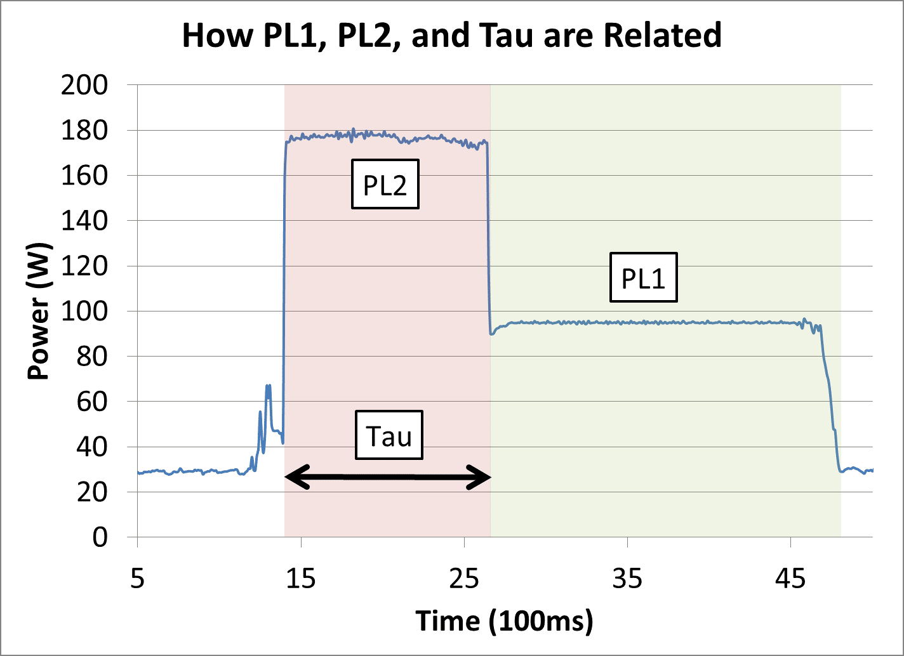

# 硬件参数查询

我们买电脑时，要根据功耗还配电源，如果是长时间运行的服务器，还要据此估算电费。
对于一台计算机而言，功耗的主力军通常就是 CPU/GPU（如果有接机械硬盘、显示器等外设，它们可能也会用掉部分功耗）。

以 CPU 为例，功耗要如何估算呢？不少人会参考官方给出的默认 TDP 数据，比如 PC 端 i7-9900K 的 TDP 是 95W，笔记本的 i7-10710U 的 TDP 是 15W 等等。

然而 TDP 仅表示 CPU 的默认功耗，并不能完全代表真实情况。
现在的 CPU 多带有频率自动调节的功能，这意味着它的功耗是在一定范围内浮动的。Intel 的睿频 Boost 与 AMD 的 SmartShift 技术，都能使实际功耗远高于标称的 TDP.

<<<<<<< HEAD
## 主机的功耗组成

电脑耗电的几个主要部件：CPU、GPU、主板、内存条、硬盘、显示器，以及其他外设。

对我的 Homelab 而言，1.2V DDR4 内存、SSD 硬盘的功耗都很小，一台机器的内存 + SSD 即使峰值功耗，应该也在 5W 以内。

比如我的西数 WD Blue SN570 1T NVMe SSD，根据官方规格书 [WD Blue SN570 NVMe SSD](https://documents.westerndigital.com/content/dam/doc-library/zh_cn/assets/public/western-digital/product/internal-drives/wd-blue-nvme-ssd/product-brief-wd-blue-sn570-nvme-ssd.pdf)，其峰值功耗为 4.5W，平均功率仅 90mW.

机械硬盘在工作状态下，功耗会高一点，一块 3.5 寸硬盘正常运行时的功率大概 6W.

CPU 是功耗大头，会在后面详细说明其功耗计算与调节方法，GPU 我 Homelab 暂时没有外置的，先忽略。

那么就只剩下主板了，那我的 GTR6/S500+/UM560 三台 MINI 主机，压测时其主板功耗能有多少呢？网上查了说普通 PC 主板的峰值功耗大概在 20W 左右，MINI 主机是否也是如此，暂时存疑。

=======
>>>>>>> fc3a87e (feat: /homelab power)
## AMD/Intel CPU 的功耗调节机制

AMD和intel的CPU在功耗限制上是完全不同的机制，intel在笔记本上用的叫DPTF，通过PL1/PL2和turbo time来控制瞬时和长时发热。

具体来说，就是当CPU高负载时，首先进入PL2阶段（高速运行状态，只能持续较短时间），然后根据intel的计算公式，将turbo time带入，此时CPU的功耗上限就是PL2，如果温度达到了阈值就会下调功耗。当运行时间与intel计算的实际turbo time匹配时，结束PL2阶段，CPU功耗会限制到PL1阶段（降频到中速运行状态），直到负载降低。



intel的计算公式和CPU前一段运行的平均功耗有关，也就是说如果烤机结束再点开始，PL2阶段会很短，这也就是为何R15循环测试跑分会掉下来。

而AMD的调节机制叫DPTC，它有3个功耗值，分别叫FAST PPT Limit、 SLOW PPT Limit和Sustained Power Limit，相应的，也有Slow PPT Time和STAPM Time。

以小新Pro13锐龙版为例，FAST PPT Limit=50W，SLOW PPT Limit=42W，Sustained Power Limit=35W，Slow PPT Time=5s，STAPM Time=200s。

intel 的 turbo time 时间 和 AMD 上面定义的这俩时间一样，都是到达该阶段前的延迟时间，也就是上一阶段停留的时间。
到PL2阶段为2.44ms也就是瞬间就会被PL2限制，到PL1阶段为28秒也就是PL2存在时间为28秒。

AMD CPU 的运行逻辑是，当CPU开始高负载时，首先进入FAST PPT Limit阶段，此时为50W，然后存留时间Slow PPT Time，也就是5秒后进入SLOW PPT Limit阶段（对应 PL2），此时为42W，等再运行了STAPM Time=200s后，进入Sustained Power Limit，此时就等于TDP 35W了。

如果要做个对比的话，intel 的 PL1 跟 AMD 的 Sustained Power Limit 比较类似，CPU 都能长时间运行在此功率下，而 intel PL2 则类似 AMD 的 FAST PPT Limit，CPU 只能在较短时间内运行在此高速状态。

## AMD CPU 功耗查询与调节案例

以我的 AMD MINI 主机为例，在 Debian/Ubuntu 系统下，可使用如下命令查询功耗：

```shell
# 下载编译
sudo apt install git
sudo apt install libpci-dev cmake gcc g++
git clone https://github.com/FlyGoat/RyzenAdj
cd RyzenAdj
mkdir build && cd build
cmake -DCMAKE_BUILD_TYPE=Release ..
make

# 查询功耗
sudo ./ryzenadj -i
```

输出内容主要关注这几项，比如我的 Beelink GTR5（R9 5900HX），通过功率计测得压测功耗为 50W，查询得到如下内容：

```shell
root@pve-gtr5:~/RyzenAdj/build# ./ryzenadj -i
CPU Family: Cezanne
SMU BIOS Interface Version: 18
Version: v0.12.0 
PM Table Version: 400005
|        Name         |   Value   |      Paramter      |
|---------------------|-----------|--------------------|
| STAPM LIMIT         |    35.000 | stapm-limit        |
| STAPM VALUE         |    10.188 |                    |
| PPT LIMIT FAST      |    35.000 | fast-limit         |
| PPT VALUE FAST      |    15.373 |                    |
| PPT LIMIT SLOW      |    35.000 | slow-limit         |
| PPT VALUE SLOW      |     9.861 |                    |
| StapmTimeConst      |   300.000 | stapm-time         |
| SlowPPTTimeConst    |     5.000 | slow-time          |
| PPT LIMIT APU       |    54.000 | apu-slow-limit     |
| PPT VALUE APU       |     9.861 |                    |
```

以及我的 MoreFine S500+（R5 5825U） 的功耗主机压测功耗为 60W，查出的功耗限制如下：

```shell
root@pve-s500plus:~/RyzenAdj# ./ryzenadj -i
CPU Family: Cezanne
SMU BIOS Interface Version: 18
Version: v0.12.0 
PM Table Version: 400005
|        Name         |   Value   |      Paramter      |
|---------------------|-----------|--------------------|
| STAPM LIMIT         |    37.501 | stapm-limit        |
| STAPM VALUE         |     3.554 |                    |
| PPT LIMIT FAST      |    40.000 | fast-limit         |
| PPT VALUE FAST      |    12.907 |                    |
| PPT LIMIT SLOW      |    37.501 | slow-limit         |
| PPT VALUE SLOW      |     3.565 |                    |
| StapmTimeConst      |   275.000 | stapm-time         |
| SlowPPTTimeConst    |     5.000 | slow-time          |
| PPT LIMIT APU       |    25.000 | apu-slow-limit     |
| PPT VALUE APU       |     3.565 |                    |
```

<<<<<<< HEAD
最后是我的 Minisfroum UM560 5625U，它的压测功耗为 45W，默认功耗限制：

```shell
root@pve-um560:~/RyzenAdj# ./ryzenadj -i
CPU Family: Cezanne
SMU BIOS Interface Version: 18
Version: v0.12.0
PM Table Version: 400005
|        Name         |   Value   |      Paramter      |
|---------------------|-----------|--------------------|
| STAPM LIMIT         |    15.000 | stapm-limit        |
| STAPM VALUE         |     5.348 |                    |
| PPT LIMIT FAST      |    30.000 | fast-limit         |
| PPT VALUE FAST      |     8.162 |                    |
| PPT LIMIT SLOW      |    25.000 | slow-limit         |
| PPT VALUE SLOW      |     2.508 |                    |
| StapmTimeConst      |   275.000 | stapm-time         |
| SlowPPTTimeConst    |     5.000 | slow-time          |
| PPT LIMIT APU       |    25.000 | apu-slow-limit     |
| PPT VALUE APU       |     2.508 |                    |
```

得到如下表格：

| Name             | Minisfroum UM560 5625U | MoreFine S500+ 5825U | Beelink GTR5 5900HX | Paramter                       | 
| ---------------- | ---------------------- | -------------------- | ------------------- | ------------------------------ | 
| STAPM LIMIT      | 15                     | 37.501               | 35                  | Sustained Power Limit（长时间运行状态） |
| STAPM VALUE      | 5.348                  | 3.554                | 10.188              |                                |
| PPT LIMIT FAST   | 30                     | 40                   | 35                  | 短时间高速运行                        |
| PPT VALUE FAST   | 8.162                  | 12.907               | 15.373              |                                | 
| PPT LIMIT SLOW   | 25                     | 37.501               | 35                  | 高速运行，时间略长于 Fast PPT Limit      | 
| PPT VALUE SLOW   | 2.508                  | 3.565                | 9.861               |                                | 
| StapmTimeConst   | 275                    | 275                  | 300                 | stapm-time 单位秒                 | 
| SlowPPTTimeConst | 5                      | 5                    | 5                   | slow-time 单位秒                  |
| PPT LIMIT APU    | 25                     | 25                   | 54                  | apu-slow-limit                 |
| PPT VALUE APU    | 2.508                  | 3.565                | 9.861               |                                |
=======
得到如下表格：

| Name             | MoreFine S500+ 5825U | Beelink GTR5 5900HX | Paramter       |
| ---------------- | -------------------- | ------------------- | -------------- |
| STAPM LIMIT      | 37.501               | 35                  | Sustained Power Limit（长时间运行状态）    |
| STAPM VALUE      | 3.554                | 10.188              |                |
| PPT LIMIT FAST   | 40                   | 35                  | 短时间高速运行     |
| PPT VALUE FAST   | 12.907               | 15.373              |                |
| PPT LIMIT SLOW   | 37.501               | 35                  | 高速运行，时间略长于 Fast PPT Limit     |
| PPT VALUE SLOW   | 3.565                | 9.861               |                |
| StapmTimeConst   | 275                  | 300                 | stapm-time 单位秒 |
| SlowPPTTimeConst | 5                    | 5                   | slow-time 单位秒  |
| PPT LIMIT APU    | 25                   | 54                  | apu-slow-limit |
| PPT VALUE APU    | 3.565                | 9.861               |                |
>>>>>>> fc3a87e (feat: /homelab power)

根据 AMD 官方资料，5900HX 这颗核心的默认 TDP 为 45W+，而且在 35W - 45W 之间可调。
再结合我们的数据，显然 GTR6 的这颗 CPU 的功耗上限被设置成了 35W。

<<<<<<< HEAD
而 5825U 这颗核心官方资料显示默认 TDP 为 15W，而且超频是不保修的，可我们查出的数据显示它的 TDP 上限竟然在 37W - 40W，这显然是超频了，超频时主板功耗估计会上升，散热压力大风扇也会满载运行，这就难怪它的压测功耗有 60W 了。

5900HX 的最低功耗就是 35W 已经无法下调，但是对于 5625U 跟 5825U，我们可以在 BIOS - advanced - AMD CBS - NBIO Common Options - Smartshift control 中将上述三个值都下调至 15W（即设置为 15000），这样就能显著降低高负载下的功耗。

等到啥时候发现 15W 性能实在不行，再考虑上调功耗限制吧。
=======
而 5825U 这颗核心官方资料显示默认 TDP 为 15W，而且超频是不保修的，可我们查出的数据显示它的 TDP 上限竟然在 37W - 40W，这显然是超频了，超频时散热压力大风扇也会满载运行，这就难怪它的压测功耗有 60W 了。

5900HX 的最低功耗就是 35W 已经无法下调，但是对于  5825U，我们可以在 BIOS - advanced - AMD CBS - NBIO Common Options - Smartshift control 中将上述三个值都下调至 15W（即设置为 15000），这样就能显著降低高负载下的功耗。

>>>>>>> fc3a87e (feat: /homelab power)

# 参考

- [How to check TDP (PL1 and PL2 power limits) in Windows and Linux](https://www.cnx-software.com/2022/09/08/how-to-check-tdp-pl1-and-pl2-power-limits-in-windows-and-linux/)
- [If you want to save power/reduce thermals - reduce PPT not voltage!](https://www.reddit.com/r/Amd/comments/ceakbs/if_you_want_to_save_powerreduce_thermals_reduce/)
