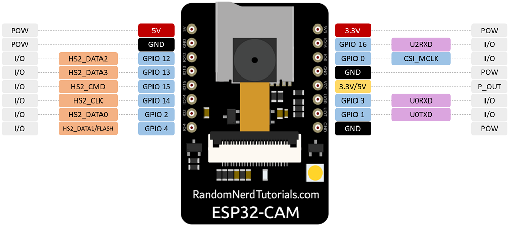
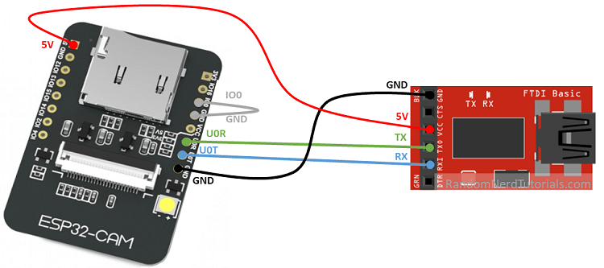

# ESPHome 玩法

ESPHome 是一个低门槛的智能家居 DIY 方案，它通过各种手段简化了智能家居设备的开发：

1. 直接通过 yaml 定义固件，所有常用的传感器社区都有支持，直接用 yaml 定义好参数就能用，不需要写任何代码。
2. 支持通过 WiFi 自动 OTA 升级，仅第一次更新需要手动通过 TTL 串口刷固件。

总之就是很小白的玩法，进阶玩法也可以直接为 ESPHome 添加模块。

## 一、注意事项

### 1. 如何连接隐藏 WiFi

添加 `fast_connect: true` 参数即可： 

```yaml
wifi:
  ssid: !secret wifi_ssid
  password: !secret wifi_password
  fast_connect: true
```


## 二、案例

### 1. 接入安信可 ESP32CAM 摄像头

安信可以前做过一款基于 ESP32 的摄像头开发板，不过貌似已经停产了。
目前市面上买得到的 ESP32CAM 基本都是第三方做的，但是结构都跟安信可的完全一样。

yaml 配置可直接参考 ESPHome 官方文档 [Configuration for Ai-Thinker Camera - ESP32 Camera Component](https://esphome.io/components/esp32_camera.html#configuration-for-ai-thinker-camera)

#### 接线并烧录固件

根据 [ESP32-CAM AI-Thinker Pinout Guide: GPIOs Usage Explained](https://randomnerdtutorials.com/esp32-cam-ai-thinker-pinout/)，ESP32-CAM 开发版的引脚定义如下：



该文档还建议使用 5V 供电，因为很多人反馈 3.3V 供电会有问题。

根据 [How to Program / Upload Code to ESP32-CAM AI-Thinker (Arduino IDE)](https://randomnerdtutorials.com/program-upload-code-esp32-cam/) 介绍，接线方式如下：



1. 首先需要将 IO0 接地，这样就将 ESP32 切换到烧录模式
2. U0R 与 U0T 是串口引脚，这里用其烧录固件
3. 5V 与 GND 也接好
4. 摄像头可以接好，但是内存卡不能插！否则会导致无法连接。（ESPHome 模式下也不需要插内存卡）

然后先通过 ESPHome 配置好 yaml 编译下载好固件，再通过 esphome web 页面将固件烧录到开发板中就 OK 了。

烧录好后就能在 HA 的「配置」-「设备与服务」中，配置添加好新连接进来的 ESP32CAM 设备。

配置完成后进入「概览」页就能看到多了一个摄像头的框框，点进去就能打开摄像头页面，不过受限于 ESP32 的性能，画面帧很低，勉强够用来当监控。
