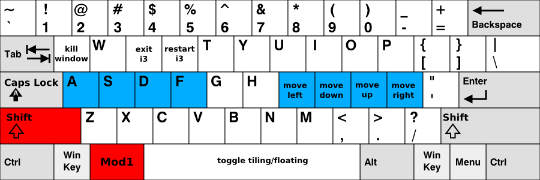

# Endeavour i3wm 使用记录

## 一、系统配置调整

### 1. 修改默认文件编辑器

默认使用的是超难用的 nano 编辑器，添加配置文件 `/etc/profile.d/editor.sh`，内容为:

```
export EDITOR=vim
```

然后重启系统，即可将默认编辑器改为 vim


## i3wm 使用入门

i3wm 自身主要通过键盘来操作，不过通过 endeavour i3wm 的底部 dock，它也支持一些常见的鼠标操作，也可通过鼠标来激活不同的 i3wm 窗口。

首先当然是官方文档 [Default keybindings - i3 User’s Guide](https://i3wm.org/docs/userguide.html#_default_keybindings)列出的，最入门级的几个键位，用多了就熟悉了。

>注意虽然 i3wm 官方文档默认的 mod 键为 alt，但是 win 实际更流行，Endeavour i3wm 这个发行版的默认 mod 键是 win！别搞错了。

i3wm 的键位分为两个 layer：

- layer 1: 通过 mod 键（默认为 win 键） + 数字键/字母键/符号键 来触发
- layer 2: 通过 mod 键 + shift + 数字键/字母键/符号键 来触发

layer 1 的键位示意图如下：


layer 2 的键位示意图如下：



简单总结下所有键位：

1. mod + enter: 打开终端
2. 窗口切换
  1. mod + 方向键: 切换到上/下/左/右的窗口
  2. mod + j/k/h/l: 切换窗口，跟用方向键效果一样
3. 窗口布局调整
   1. mod + shift + 方向键：将当前窗口向上下左右移动，这会改变窗口布局。
   2. mod + shift + j/k/h/l: 功能同上
   3. mod + f: 将当前窗口全屏显示或退出全屏
   4. mod + v: 使用此快捷键后，新键的窗口会垂直分割当前窗口（在当前窗口下方新建窗口）。
   5. mod + h: 使用此快捷键后，新键的窗口会水平分割当前窗口（在当前窗口右侧新建窗口）。
   6. workspace 的布局调整
      1. mod + e: 将当前 workspace 的布局在水平分割与垂直分割之间切换
      2. mod + s: 将当前 workspace 的布局切换为堆叠模式
      3. mod + w: i3wm 官方文档说是切换为 tabbed 模式，但是 endeavour i3wm 的这个快捷键功能好像不一样
4. 关闭窗口：
   1. i3wm 官方文档说是 mod + shift + q，在 layer 2
   2. 不过这个命令用得比较频繁，所以 endeavour i3wm 默认改成了 **mod + q**
5. 打开其他应用
   1. mod + d: 打开 dmenu，可以通过 dmenu 来搜索打开其他应用
6. workspace 切换（workspace 是窗口的容器，可以在当前显示器上切换显示不同的工作区）
   1. mod + 数字键: 将指定的 workspace 在当前显示器中展示
   2. mod + shift + 数字键: 将当前窗口移动到指定的 workspace
7. 直接通过鼠标拖拽两个窗口的交界处，即可调整窗口大小
   1. 不过我实际试了发现不太好操作，要试好几次才能触发窗口大小调整功能。
8. 浮动窗口：
   1. mod + shift + space: 将当前窗口切换为浮动窗口或者切换回非浮动窗口
   2. 它使窗口悬浮在其他窗口之上，不受布局影响。
   3. 可以通过鼠标拖拽浮动窗口的 title bar 来移动窗口位置
      1. 但是我实测发现个别程序（比如 vscode）浮动后拖拽不了，不知道啥 bug
9. 使用 floating modifier（默认为 win 键） + 鼠标左键拖拽窗口的 title bar，可以修改快速窗口布局。

学会上面几个快捷键，就算是入门 i3wm 了，后面就可以根据自己的需求去调整 i3wm 配置了~

## 三、网络配置

endeavour i3wm 自带的 GUI 程序 Advanced Network Configuration 自带了最基础的网络配置功能，也可以通过命令行程序 `nmtui`/`nmcli` 进行配置修改，其中 nmtui 提供了命令行 UI 窗口。

## 四、显示器调节

### 最佳方案 - 使用 xrandr/arandr

>endeavour i3wm 官方文档也建议使用此方案 [Display setup with arandr - endeavouros-i3wm-setup](https://github.com/endeavouros-team/endeavouros-i3wm-setup#display-setup-with-arandr)


>此方案适用于所有显示器，但是我测试发现它的亮度又跟前面的 ACPI 有点区别，笔记本内置显示器无法通过 xrandr 将亮度调节到 1 以上。

Endeavour i3wm 使用 X11 窗口系统，默认使用 [xrandr](https://wiki.archlinux.org/title/xrandr) 配置显示器参数，包括亮度调节、分辨率、方向、多显示器拓扑等。

同时它也预装了 xrandr 的 GUI 程序 [ARandR](https://github.com/haad/arandr)，这个程序支持了常用的显示器设置。

但是背光亮度还是得通过命令行调整，方法如下：

```shell
# 首先查询当前系统显示状态
# 能看到我有两个显示器， 4K 显示器 DP-0 与 @k 显示器 DP-4
❯ xrandr -q | grep ' connected'
DP-0 connected primary 3840x2160+0+0 (normal left inverted right x axis y axis) 709mm x 399mm
DP-4 connected 2560x1600+3840+560 (normal left inverted right x axis y axis) 345mm x 215mm

# 然后通过如下命令即可调整亮度，建议尝试下 0.5 - 1.0 之间的值
# 低于 0.5 太暗，高于 1.0 太亮
xrandr --output DP-0 --brightness 0.7
```

#### 持久化配置

但是此方法仅支持临时调节，重启后就失效了，为了能够长期生效，可以将上述配置写成脚本，再修改 i3wm 配置，使其在用户登录 i3wm 后执行上述命令。

首先将你的配置修改命令保存为 shell 脚本，比如说 `$HOME/.screenlayout/external-4k.sh`

然后修改 i3wm 配置文件 `~/.config/i3/config`，添加如下配置：

```shell
# 在启动 i3wm 时配置我的 4K 外接显示器
exec_always bash $HOME/.screenlayout/external-4k.sh
```

现在就可以重启系统或者重新登录 i3wm，看看亮度是否生效了。

### 其他方法

>发现 Linux 亮度调节也是个坑，这么多方案...


#### 1. 临时通过 /sys/class/backlight 调整亮度

>目前测试发现，此方法仅适用于笔记本内置显示器，不适用于通过 HDMI/DP 接入的外接显示器

>仅支持临时调节，重启后失效

带背光的显示器（OLED 除外，它是像素本身发光），其亮度调节原理实际就是通过调节屏幕背光 LED 灯的电压来实现亮度变化，因此通常笔记本的内置显示器都可通过 ACPI 内核电源管理模块来调节，该模块通过 /sys/class/backlight 暴露出了所有显示设备的亮度调节接口。

首先查询下有哪些设备：

```shell
❯ ls /sys/class/backlight/
nvidia_0
```

这里提示有一个 nvidia_0 设备，这是我笔记本的内置显示器，显然看名字就知道它目前接到了 Nvidia GPU 上。

>实际上我还有台外接显示器，但是外接显示器就不是 ACPI

看下它的亮度范围：

```shell
❯ cat /sys/class/backlight/nvidia_0/max_brightness 
100
```

那么范围是 0 - 100，那么先将其设为 50 看看：

```shell
# 如下命令需要 root 权限！
echo 50 > /sys/class/backlight/nvidia_0/brightness 
```

不出意外应该能发现亮度改成功了。

#### 2. 使用 ddcutil

对于外接显示器，还可通过 ddcutil 来调节亮度，不过我没搞定这个...

通过 HDMI 接入了我的 4K 显示器，但一直报错 /dev/i2c 设备不存在...

其他方案参见文档 [Backlight - Arch Linux WiKi](https://wiki.archlinux.org/title/backlight)
